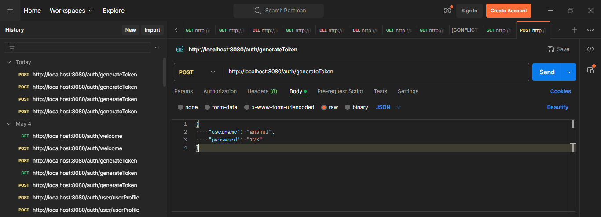

# Nền tảng Tin tức và bài viết (News And Blog)

## Thành Viên Nhóm
- Bùi Trần Thiên Ân
- Nguyễn Phi Thiên

## Kiến Trúc Hệ Thống
Hệ thống bao gồm các service chính sau đây, được triển khai dựa trên kiến trúc microservices:

### 1. `Authentication Service với JWT`
Sử dụng JWT để Xác thực (Authentication) và Phân quyền (Authorization) trong Spring Boot 3.0, dùng Spring Security 6 và MariaDB.
Các tính năng sử dụng trong project:
+ Thêm user mới với role là USER hoặc ADMIN, password được mã hoá.
+ Tạo token đăng nhập.

### 2. `Redis database`
Sử dụng Redis để lưu trữ dữ liệu cần được truy cập thường xuyên và nhanh chóng, nó không được dùng để lưu trữ dữ liệu lớn.
Các tính năng sử dụng trong project:
+ Lưu token sau khi generate token.
+ Đọc dữ liệu token đã lưu.
## Hướng Dẫn Chạy Project

### 1. `Authentication Service với JWT`
+ Tạo user mới
  
+ Tạo token để đăng nhập
  
+ Đăng nhập với quyền ADMIN
  

### 2. `Redis database`
+ Setup Redis cho Window:
   https://www.youtube.com/watch?v=DLKzd3bvgt8

+ Mở 1 tab cmd, run command line "redis-server" để start Redis
  
+ Run AuthenticationService Project
+ Mở Postman
  POST: http://localhost:8080/auth/generateToken
  Body --> raw --> JSON: {"username": "anshul", "password": "123"}
  
+ Mở 1 tab cmd khác, run command line "redis-cli", chạy các lệnh như hình:
  

