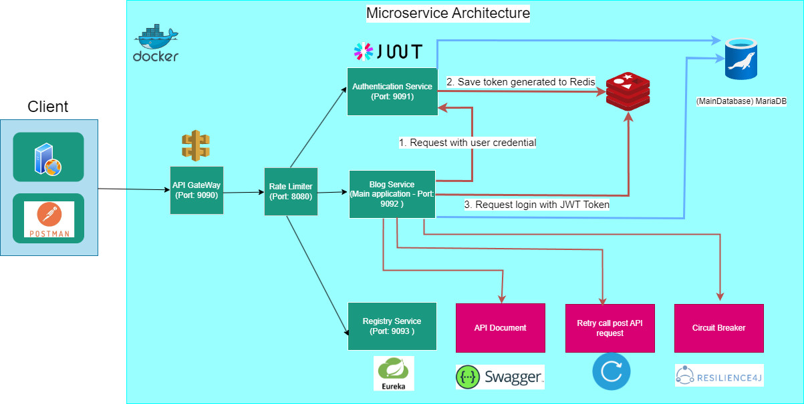

# Nền tảng Tin tức và bài viết (News And Blog)

## Thành Viên Nhóm
- Bùi Trần Thiên Ân
- Nguyễn Phi Thiên
## Kiến trúc hệ thống
  
## Run Application

### `1. Run các Service`
+ RegistryService (port: 9093)
+ BlogService (port: 9092)
+ AuthenticationService (port: 8080)
+ ApiGateway (port: 9090)

### `2. Điều hướng cổng với Apigateway`
+ Gateway sẽ chuyển các port khác (9091, 9092, ...) thành cùng 1 port là 9090.
+ Ví dụ:
http://localhost:9092/api/post/posts được chuyển thành http://localhost:9090/api/post/posts 
http://localhost:9091/api/user/users được chuyển thành http://localhost:9090/api/user/users

### `3. Xem Api document với Swagger UI`
+ Swagger UI là một Api document cho các Service.
+ Sau khi run BlogService, bạn có thể truy cập http://localhost:9092/swagger-ui/index.html để xem Api document của BlogService.

### `4. Authentication Service với JWT`
+ Tạo user mới
  PATH: http://localhost:8080/auth/addNewUser
  
  METHOD: POST
  
  BODY: {"name": "rekddy", "password": "123456", "email": "phithien2k2@gmail.com", "roles": "ROLE_ADMIN"}
  
+ Tạo token để đăng nhập
  PATH: http://localhost:8080/auth/generateToken
  METHOD: POST
  BODY: {"username":"rekddy", "password":"123456"}
  
+ Đăng nhập với quyền ADMIN
  PATH: http://localhost:8080/auth/login/admin
  METHOD: GET
  Bearer Token
  

### `5. Lưu token với Redis`
+ Setup Redis cho Window:
   https://www.youtube.com/watch?v=DLKzd3bvgt8

+ Mở 1 tab cmd, run command line "redis-server" để start Redis
  
+ Run AuthenticationService Project
+ Mở Postman
  POST: http://localhost:8080/auth/generateToken
  Body --> raw --> JSON: {"username": "anshul", "password": "123"}
  
+ Mở 1 tab cmd khác, run command line "redis-cli", chạy các lệnh như hình:
  

### `6. Retry`
+ Giả lập http://localhost:9090/post/retry có thể trả về kết quả ngẫu nhiên của các trạng thái sau: 200 (OK), 400 (Bad Request), 408 (Request Timeout), 500 (Internal Server Error), 503 (Service Unavailable)
+ Nếu kết quả trả về các status code khác 200 thì sẽ chuyển đến trang post/error
  
+ Ngược lại sẽ chuyển đến trang post/posts nếu trả về status code là 200.
  

### `7. Circuit Breaker với Resilience4j`
+ Khi bạn dừng hoạt động BlogService sau đó truy cập lại http://localhost:9090/post/**/ bạn sẽ nhận được kết quả thông báo BlogService đã dừng hoạt động.
  
